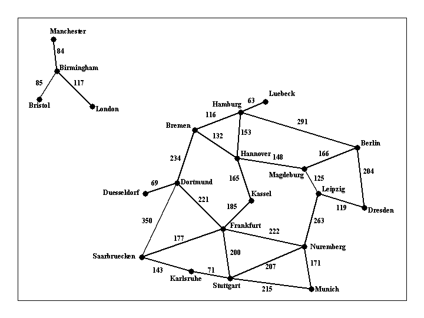

# Artficial-Intelligence

**Assignment 1** is implementing a state space search algorithm that can a find a route between any two cities. The program will be called find_route, and will take exactly commandline aruments as follows:

  >python3 find_route.py input1.txt Bremen Kassel (For doing Uninformed Search)
  
  or 
  
  >python3 find_route.py input1.txt Bremen Kassel h_kassel.txt (For doing Informed Search)

Argument input_filename is the name of a text file such as input1.txt, that describes road connections between cities in some part of the world. For example, the road system described by file input1.txt can be visualized with the photo below:

The last line contains the items "END OF INPUT" and that is how the program can detect that it has reached the end of the file. The other lines of the file contain, in this order, a source city, destination city, and the length in kilometers of the road connecting directly those two cities. Each name will be a single word

## Compilation Instruction and Programming Language 

* The programming language used is C++ and no thrid party library was used just the SL. 
* The user needs a g++ compiler to compile the code c++11>

  #### Uninformed Search 
       python3 find_route.py input1.txt Bremen Kassel
      
  #### Informed Search
       python3 find_route.py input1.txt Bremen Kassel h_kassel.txt
  
  
 ## About the Code
  
 The code implements A* Search (Informed Search) and Uniform Cost Search (Uninformed Search) algorithm. The code reads in the input file and stores it into a multimap to list all the possible outcomes for a specific node that will be used when determining the successors of one state. The A* does this as well but reads in and stores data from h_kassel.txt and stores the data into a map data structure. The input data is stored into a multimap and the heuristics are stored into a map.
